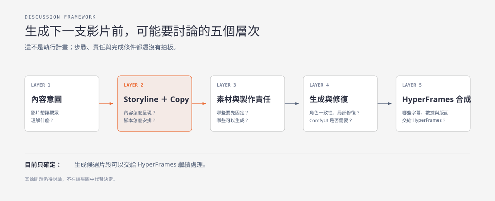

# 題目一：文章到短影音 Workflow

> **下一步：** 選一篇代表性文章，先完成 `Content Brief → Story Package → Production Contract`，再沿用現有生成與 HyperFrames handoff，做出第一支約 30 秒完整影片。

## 30 秒讀完

| 你要知道的事 | 結論 |
|---|---|
| 現在跑通了什麼？ | **Layer 4 → 5 的技術接線**：生成候選能交給 HyperFrames 合成。 |
| 還缺什麼？ | **Layer 1 → 3**：內容意圖、Storyline／Copy、製作責任契約。 |
| ComfyUI 在哪裡？ | 主要在 **Layer 4 素材生成與修復**；它不是完整 workflow。 |
| 五層都要跑嗎？ | 要。五層都有最小產物，才能稱為端到端 workflow 跑通。 |
| 下一步做什麼？ | 先補 Story Package，不再增加 ComfyUI 節點。 |

## 這輪只做 3 步

1. **鎖內容：** 決定觀眾、單一 takeaway、必留事實與禁止延伸的主張。
2. **鎖故事：** 寫出 4 beats、完整旁白、畫面意圖與來源。
3. **做成片：** 分配生成／固定素材責任，產出、局部修復、HyperFrames 合成並 QA。

## 怎樣才算完成？

| 狀態 | 完成條件 | 目前 |
|---|---|---|
| 技術接線跑通 | 生成片段可交給 HyperFrames 並輸出 | **已完成** |
| 端到端可行 | 一篇文章走完五層，留下中間產物與 QA | **下一步** |
| 流程穩定 | 同一模板跨多篇文章可重跑 | 尚未驗證 |
| 可以量產 | 跨模板批次測試，失敗率、成本與人工量可接受 | 尚未驗證 |

單篇成功只能證明「可行」，不能證明「穩定」或「可量產」。

---

<strong>展開：五層各自要交付什麼</strong>

### Layer 1｜內容意圖

回答：**給誰看？看完只要記住什麼？**

輸出 `Content Brief`：

- 原始文章與可引用事實。
- 目標觀眾與一句話 takeaway。
- 必須保留的數字與因果邊界。
- 不可延伸或暗示的主張。

### Layer 2｜Storyline ＋ Copywriting

回答：**資訊要按什麼順序被理解？**

輸出 `Story Package`：

1. 一句話 premise 與敘事形式。
2. 4 beats：Hook → 發生什麼 → 為什麼重要 → 結論。
3. 完整旁白稿；以實際 TTS 時間控制片長。
4. 每段畫面意圖、螢幕文字與事實來源。
5. 禁止生成的錯誤陳述、投資暗示與無來源數字。

沒有這一層，後面就會變成抽籤：單一畫面可能好看，但敘事與節奏無法穩定重現。

### Layer 3｜製作責任鎖定

回答：**哪些必須固定？哪些允許生成？**

輸出 `Production Contract`：

- Storyboard／ShotSpec、秒數與素材來源。
- 生成素材、固定素材與人工 Gate 的分界。
- 角色、場景與攝影語言的 continuity 規則。
- repair／regenerate 規則。
- 最終 QA 與接受／退回條件。

固定主播或重複角色是核心時，影片生成前先建立 character reference kit。若採 data-first 解釋片，角色可以只是可替換 B-roll。

### Layer 4｜素材生成與修復

**ComfyUI 主要在這裡。**它可承接：

- 人物、場景、B-roll 與視覺比喻生成。
- reference、ControlNet、LoRA 等一致性控制。
- inpainting、局部重繪、放大與補幀。
- 可重用的多階段生成 workflow。

單支端到端實驗可直接使用模型 API。當角色一致性、局部修復或多階段控制成為重複需求，ComfyUI 的價值才會提高。

### Layer 5｜HyperFrames ＋ QA

HyperFrames 優先承接必須確定、可重現的部分：

- 財經事實、數字、圖表與來源。
- 字幕、品牌、safe zone 與 disclaimer。
- timeline、轉場、聲音時間點與排版。
- 生成片段與固定元件的合成。
- 輸出格式與最終 QA。

<strong>展開：目前證據能支持到哪裡</strong>

目前 preflight 實際流程：

> 既定 reference → 生成兩個候選 → 人工選片 → HyperFrames 疊加固定圖文 → 輸出

因此可以說：

> **Generation-to-HyperFrames integration preflight 已跑通。**

不能說：

> **Article-to-video production workflow 已跑通。**

尚未驗證：

- 原文如何形成 takeaway、storyline 與旁白。
- 約 30 秒多段敘事是否連貫且看得懂。
- 角色一致性、局部修復及失敗重做策略。
- 跨文章、跨模板與批次生成是否穩定。
- 實際人工時間、成本與溝通量。

<strong>展開：工具責任怎麼分</strong>

| 責任 | 優先承接者 |
|---|---|
| 觀眾、takeaway、storyline、旁白 | 內容流程＋必要人工 Gate |
| 人物、場景、B-roll、視覺比喻 | 生成模型；複雜鏈路可由 ComfyUI 編排 |
| 角色一致性與局部修復 | ComfyUI／模型能力 |
| 數字、圖表、字幕、品牌、來源 | HyperFrames |
| 最終接受／退回 | 人工 QA |

工具可以替換；各層的輸入／輸出契約不能消失。

<strong>展開：網路 Best Practices 怎麼用</strong>

網路上已有大量短影音敘事、角色一致性、局部修復與 ComfyUI production 做法。它們應用來補強各層的控制方法，不是用更多工具取代內容決策。

正確比較順序：

1. 先固定同一份 `Story Package`。
2. 再固定同一份 `Production Contract`。
3. 最後比較 ComfyUI、直接 API 或託管服務。

否則比較到的可能只是不同隨機輸出，而不是 workflow 能力。

## 下一輪要留下的 5 份證據

1. `Content Brief`
2. `Story Package`
3. `Production Contract／ShotSpec`
4. 生成參數、失敗與 repair 紀錄
5. HyperFrames composition、成片與完整 QA

本文件補充 [`task1.md`](./task1.md) 的執行定義；原檔繼續作為主管交辦的任務 truth。
